# ILE-RPG Code Checker - Implementation Design

## 1. Architecture Overview

### 1.1 System Architecture

```mermaid
graph TB
    Client[MCP Client<br/>IBM Bob / Claude Desktop / Cline]
    
    subgraph Server[RPG Standards Checker MCP Server]
        subgraph Tools[Tool Interface Layer]
            T1[check_rpg_code]
            T2[check_specification_order]
            T3[check_column_positions]
            T4[check_naming_conventions]
            T5[check_best_practices]
            T6[check_rpg_file]
        end
        
        subgraph Orchestration[Orchestration Layer]
            O1[Check Level Management<br/>basic/standard/strict]
            O2[Result Aggregation]
            O3[Report Generation]
        end
        
        subgraph Parser[Parser Layer]
            P1[Line-by-line Parsing]
            P2[Specification Type Detection]
            P3[Token Extraction]
        end
        
        subgraph Checkers[Checker Layer]
            C1[Structure Checker<br/>- Specification order<br/>- Column positions<br/>- Line length]
            C2[Syntax Checker<br/>- Line continuation<br/>- Multiple statements<br/>- FREE/END-FREE matching]
            C3[Naming Checker<br/>- Variable naming<br/>- Procedure naming<br/>- Special characters]
            C4[Best Practice Checker<br/>- Deprecated features<br/>- Indicator usage<br/>- FREE format recommendation]
            C5[Common Errors Checker<br/>- F-spec space issues<br/>- D-spec column errors<br/>- Continuation errors]
        end
        
        subgraph Rules[Rules Engine]
            R1[Rule Definitions]
            R2[Rule Evaluation Logic]
        end
    end
    
    Client -->|MCP Protocol| Tools
    Tools --> Orchestration
    Orchestration --> Parser
    Parser --> Checkers
    Checkers --> Rules
    Rules --> Checkers
    Checkers --> Parser
    Parser --> Orchestration
    Orchestration --> Tools
    Tools -->|Results| Client
    
    style Client fill:#b3d9ff,stroke:#0066cc,stroke-width:2px,color:#000
    style Server fill:#ffe6b3,stroke:#cc8800,stroke-width:2px,color:#000
    style Tools fill:#c2e0c6,stroke:#2d7a3e,stroke-width:2px,color:#000
    style Orchestration fill:#e6ccff,stroke:#7a2d9e,stroke-width:2px,color:#000
    style Parser fill:#fff4b3,stroke:#ccaa00,stroke-width:2px,color:#000
    style Checkers fill:#ffcccc,stroke:#cc3333,stroke-width:2px,color:#000
    style Rules fill:#b3e6e6,stroke:#008080,stroke-width:2px,color:#000
    
    %% Tool boxes
    style T1 fill:#d4f1d4,stroke:#2d7a3e,stroke-width:1px,color:#000
    style T2 fill:#d4f1d4,stroke:#2d7a3e,stroke-width:1px,color:#000
    style T3 fill:#d4f1d4,stroke:#2d7a3e,stroke-width:1px,color:#000
    style T4 fill:#d4f1d4,stroke:#2d7a3e,stroke-width:1px,color:#000
    style T5 fill:#d4f1d4,stroke:#2d7a3e,stroke-width:1px,color:#000
    style T6 fill:#d4f1d4,stroke:#2d7a3e,stroke-width:1px,color:#000
    
    %% Orchestration boxes
    style O1 fill:#f0e0ff,stroke:#7a2d9e,stroke-width:1px,color:#000
    style O2 fill:#f0e0ff,stroke:#7a2d9e,stroke-width:1px,color:#000
    style O3 fill:#f0e0ff,stroke:#7a2d9e,stroke-width:1px,color:#000
    
    %% Parser boxes
    style P1 fill:#fff8cc,stroke:#ccaa00,stroke-width:1px,color:#000
    style P2 fill:#fff8cc,stroke:#ccaa00,stroke-width:1px,color:#000
    style P3 fill:#fff8cc,stroke:#ccaa00,stroke-width:1px,color:#000
    
    %% Checker boxes
    style C1 fill:#ffe0e0,stroke:#cc3333,stroke-width:1px,color:#000
    style C2 fill:#ffe0e0,stroke:#cc3333,stroke-width:1px,color:#000
    style C3 fill:#ffe0e0,stroke:#cc3333,stroke-width:1px,color:#000
    style C4 fill:#ffe0e0,stroke:#cc3333,stroke-width:1px,color:#000
    style C5 fill:#ffe0e0,stroke:#cc3333,stroke-width:1px,color:#000
    
    %% Rules boxes
    style R1 fill:#ccf2f2,stroke:#008080,stroke-width:1px,color:#000
    style R2 fill:#ccf2f2,stroke:#008080,stroke-width:1px,color:#000
```



## 2. Data Structures

### 2.1 Core Type Definitions

```typescript
// Issue severity levels
type Severity = 'error' | 'warning' | 'info';

// Issue categories
type Category = 
  | 'structure'      // Structural issues
  | 'syntax'         // Syntax issues
  | 'naming'         // Naming convention issues
  | 'best-practice'  // Best practice violations
  | 'deprecated';    // Deprecated feature usage

// Check levels
type CheckLevel = 'basic' | 'standard' | 'strict';

// Specification types
type SpecificationType = 
  | 'H'  // Control specification
  | 'F'  // File description specification
  | 'D'  // Definition specification
  | 'P'  // Procedure specification
  | 'I'  // Input specification
  | 'C'  // Calculation specification
  | 'O'  // Output specification
  | 'FREE'      // Fully free format
  | 'COMMENT'   // Comment line
  | 'UNKNOWN';  // Unknown

// Issue details
interface Issue {
  severity: Severity;
  category: Category;
  line: number;
  column?: number;
  endColumn?: number;
  message: string;
  rule: string;
  ruleDescription?: string;
  suggestion?: string;
  codeSnippet?: string;
}

// Check result summary
interface Summary {
  totalIssues: number;
  errors: number;
  warnings: number;
  infos: number;
  checkedLines: number;
  specificationCounts: Record<SpecificationType, number>;
}

// Check result
interface CheckResult {
  valid: boolean;
  issues: Issue[];
  summary: Summary;
}

// Parsed line information
interface ParsedLine {
  lineNumber: number;
  rawContent: string;
  trimmedContent: string;
  specificationType: SpecificationType;
  isComment: boolean;
  isContinuation: boolean;
  columnData?: {
    [key: string]: string;
  };
}
```

### 2.2 Rule Definitions

```typescript
interface Rule {
  id: string;
  name: string;
  description: string;
  category: Category;
  severity: Severity;
  checkLevel: CheckLevel;
  check: (line: ParsedLine, context: CheckContext) => Issue | null;
}

interface CheckContext {
  allLines: ParsedLine[];
  currentIndex: number;
  previousSpec?: SpecificationType;
  inFreeForm: boolean;
  freeFormDepth: number;
}
```

## 3. Major Component Implementation Details

### 3.1 RPGParser (src/parser/rpg-parser.ts)

The RPG parser is responsible for parsing RPG source code line by line and extracting relevant information for validation.

**Key Responsibilities:**
- Line-by-line parsing
- Specification type detection
- Comment line identification
- Continuation line detection
- Column data extraction

**Main Methods:**
- `parse(code: string): ParsedLine[]` - Parses entire source code
- `parseLine(line: string, lineNumber: number): ParsedLine` - Parses a single line
- `detectSpecificationType(line: string): SpecificationType` - Detects specification type
- `isCommentLine(line: string): boolean` - Checks if line is a comment
- `isContinuationLine(line: string, specType: SpecificationType): boolean` - Checks for continuation
- `extractColumnData(line: string, specType: SpecificationType)` - Extracts column-specific data

### 3.2 StructureChecker (src/checkers/structure-checker.ts)

Validates the structural aspects of RPG code according to coding standards.

**Checks Performed:**
1. **Specification Order** - Validates H→F→D→P→I→C→O order
2. **Column Positions** - Validates column position rules for each specification type
3. **Line Length** - Ensures lines don't exceed 100 columns
4. **DBCS Support** - Accounts for shift characters in DBCS strings

**Key Methods:**
- `checkSpecificationOrder(lines: ParsedLine[]): Issue[]`
- `checkColumnPositions(lines: ParsedLine[], considerDBCS: boolean): Issue[]`
- `checkLineLength(lines: ParsedLine[]): Issue[]`

### 3.3 SyntaxChecker (src/checkers/syntax-checker.ts)

Validates syntax rules and conventions.

**Checks Performed:**
1. **Line Continuation** - Validates continuation line rules
2. **Multiple Statements** - Prohibits multiple statements on one line
3. **FREE/END-FREE Matching** - Ensures proper pairing
4. **FREE Format Usage** - Validates **FREE format usage

**Key Methods:**
- `checkLineContinuation(lines: ParsedLine[]): Issue[]`
- `checkMultipleStatements(lines: ParsedLine[]): Issue[]`
- `checkFreeFormMatching(lines: ParsedLine[]): Issue[]`

### 3.4 NamingChecker (src/checkers/naming-checker.ts)

Validates naming conventions for variables, procedures, and other identifiers.

**Checks Performed:**
1. **Variable Names** - Validates variable naming conventions
2. **Procedure Names** - Validates procedure naming conventions
3. **Special Characters** - Restricts special character usage
4. **Meaningful Names** - Recommends descriptive names

**Naming Rules:**
- Minimum length requirements
- No leading numbers
- Restricted special characters
- CamelCase or snake_case conventions
- Avoid single-letter names (except loop counters)

**Key Methods:**
- `checkVariableNames(lines: ParsedLine[]): Issue[]`
- `checkProcedureNames(lines: ParsedLine[]): Issue[]`
- `validateNameFormat(name: string): boolean`

### 3.5 BestPracticeChecker (src/checkers/best-practice-checker.ts)

Identifies deprecated features and recommends best practices.

**Checks Performed:**
1. **Deprecated Features** - Detects GOTO, TAG, etc.
2. **Indicator Usage** - Warns about numbered indicators
3. **FREE Format** - Recommends fully free format
4. **Custom Rules** - Supports user-defined rules via JSON

**Deprecated Features Detected:**
- GOTO/TAG
- Numbered indicators (*IN01-*IN99)
- MOVE/MOVEL (recommend EVAL)
- Fixed-format when free-format is available

**Key Methods:**
- `checkDeprecatedFeatures(lines: ParsedLine[]): Issue[]`
- `checkIndicatorUsage(lines: ParsedLine[]): Issue[]`
- `checkCustomRules(lines: ParsedLine[], customRulesPath?: string): Issue[]`

## 4. MCP Tools Implementation

### 4.1 Tool Definitions

The MCP server provides 6 tools for code checking:

#### 1. check_rpg_code
Comprehensive check of RPG source code.

**Parameters:**
- `code` (required): RPG source code string
- `checkLevel` (optional): 'basic' | 'standard' | 'strict'
- `language` (optional): 'en' | 'ja'
- `considerDBCS` (optional): boolean
- `customRulesPath` (optional): string

**Returns:** CheckResult

#### 2. check_specification_order
Checks specification order only.

**Parameters:**
- `code` (required): RPG source code string
- `language` (optional): 'en' | 'ja'

**Returns:** CheckResult

#### 3. check_column_positions
Checks column position rules.

**Parameters:**
- `code` (required): RPG source code string
- `language` (optional): 'en' | 'ja'
- `considerDBCS` (optional): boolean

**Returns:** CheckResult

#### 4. check_naming_conventions
Checks naming conventions.

**Parameters:**
- `code` (required): RPG source code string
- `language` (optional): 'en' | 'ja'

**Returns:** CheckResult

#### 5. check_best_practices
Checks best practices and deprecated features.

**Parameters:**
- `code` (required): RPG source code string
- `language` (optional): 'en' | 'ja'
- `customRulesPath` (optional): string

**Returns:** CheckResult

#### 6. check_rpg_file
Reads and checks an RPG file.

**Parameters:**
- `filePath` (required): Path to RPG file
- `checkLevel` (optional): 'basic' | 'standard' | 'strict'
- `language` (optional): 'en' | 'ja'
- `considerDBCS` (optional): boolean
- `customRulesPath` (optional): string

**Returns:** CheckResult with filePath

## 5. Check Level Definitions

### 5.1 Basic
Performs essential checks only:
- Specification order
- Critical syntax errors
- Line length violations

### 5.2 Standard (Default)
Includes Basic checks plus:
- Column position validation
- Line continuation rules
- Common error detection

### 5.3 Strict
Includes Standard checks plus:
- Naming convention validation
- Best practice recommendations
- Deprecated feature warnings
- Custom rule evaluation

## 6. Multi-language Support

### 6.1 Implementation (src/i18n/messages.ts)

The system supports multiple languages through a centralized message system:

**Supported Languages:**
- English (en) - Default
- Japanese (ja) - Full support

**Message Categories:**
- Error messages
- Warning messages
- Info messages
- Rule descriptions
- Suggestions

**Usage:**
```typescript
import { getMessage } from './i18n/messages';

const message = getMessage('SPEC_ORDER_ERROR', 'ja', {
  expected: 'H',
  found: 'F'
});
```

## 7. DBCS Character Support

### 7.1 Implementation (src/utils/dbcs-helper.ts)

Provides utilities for handling Double-Byte Character Set (DBCS) characters:

**Features:**
- DBCS character detection (Japanese, Chinese, Korean)
- Shift character (SO/SI) consideration
- Accurate byte length calculation
- Column position adjustment

**Key Functions:**
- `isDBCS(char: string): boolean` - Detects DBCS characters
- `calculateByteLength(str: string): number` - Calculates byte length with shift characters
- `adjustColumnPosition(str: string, position: number): number` - Adjusts for DBCS

## 8. Custom Rules Support

### 8.1 Implementation (src/config/custom-rules.ts)

Allows users to define custom best practice rules via JSON configuration:

**Rule Properties:**
- `id`: Unique identifier
- `name`: Display name
- `description`: Detailed description
- `pattern`: Regular expression pattern
- `severity`: 'error' | 'warning' | 'info'
- `suggestion`: Fix recommendation
- `enabled`: true | false

**Example Custom Rule:**
```json
{
  "rules": [
    {
      "id": "no-select-all",
      "name": "Avoid SELECT *",
      "description": "Using SELECT * is not recommended",
      "pattern": "SELECT\\s+\\*",
      "severity": "warning",
      "suggestion": "Specify column names explicitly",
      "enabled": true
    }
  ]
}
```

## 9. Future Enhancement Possibilities

### 9.1 Additional Features
- SQL embedded statement validation
- Performance optimization suggestions
- Code complexity metrics
- Automated refactoring suggestions
- Integration with version control systems

### 9.2 Performance Optimization
- Parallel processing for large files
- Incremental checking for modified lines
- Caching of parse results
- Optimized regex patterns

## 10. Testing Strategy

### 10.1 Unit Tests
- Parser component tests
- Individual checker tests
- Rule evaluation tests
- DBCS handling tests

### 10.2 Integration Tests
- End-to-end tool execution
- Multi-language message tests
- Custom rules loading tests
- File reading tests

### 10.3 Test Data
- Valid RPG code samples
- Invalid code with known issues
- Edge cases (empty files, very long lines)
- DBCS character test cases

## 11. Documentation

### 11.1 User Documentation
- README.md (English)
- README.ja.md (Japanese)
- Usage examples
- Troubleshooting guide

### 11.2 Developer Documentation
- This design document
- Code comments
- API documentation
- Architecture diagrams

---

**Version:** 0.0.7
**Last Updated:** 2026-02-12
**Status:** Implementation Complete